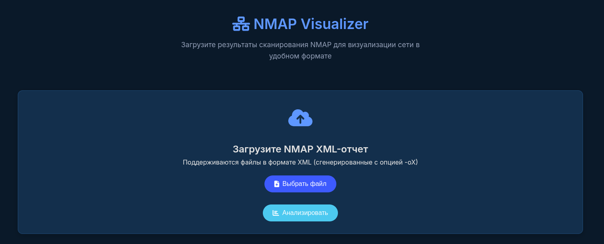
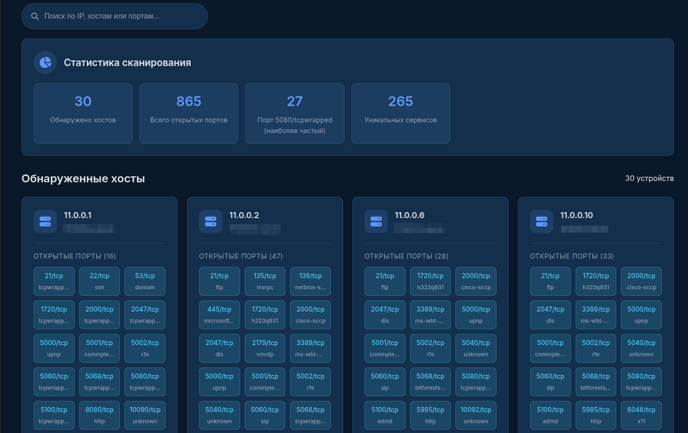
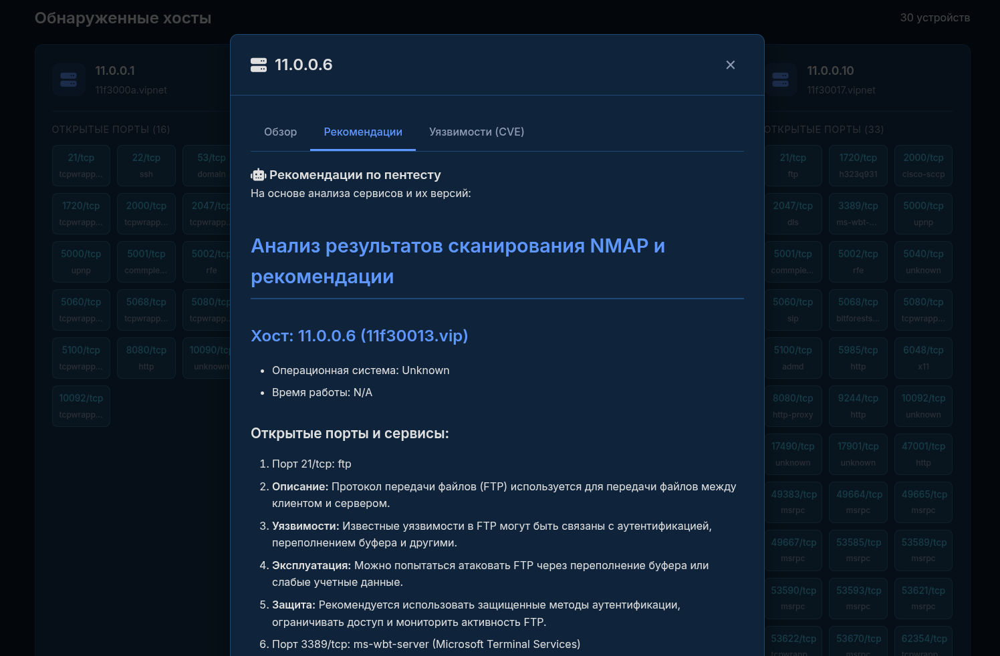
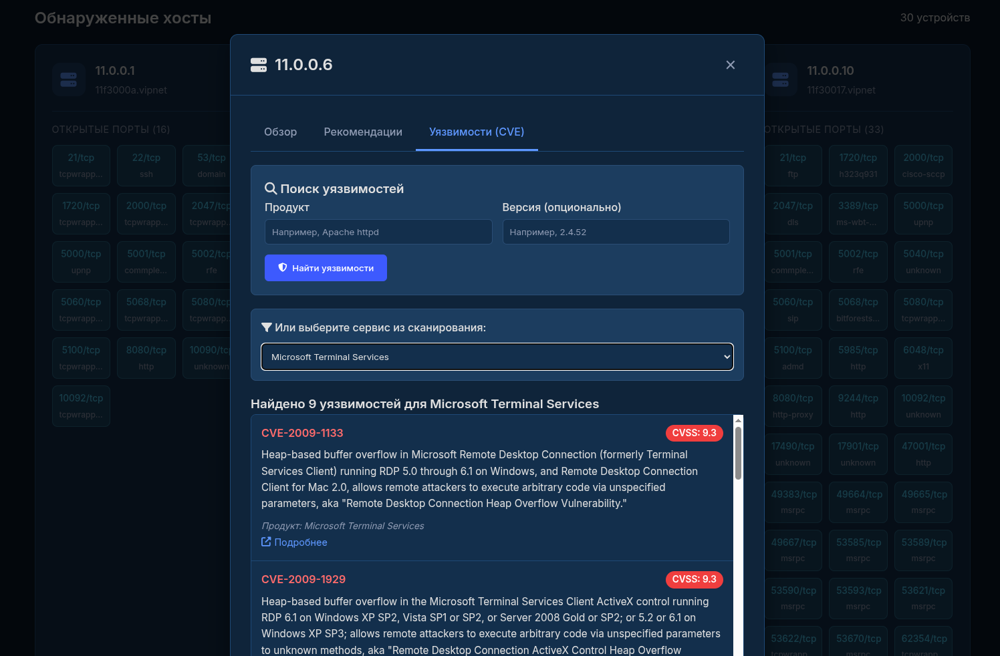

# NMAP Visualizer with Pentest AI Assistant

## Обзор проекта

NMAP Visualizer - это веб-приложение для анализа и визуализации результатов сканирования Nmap с расширенными возможностями для пентестеров. Проект предоставляет:

- Визуализацию результатов сканирования в удобном интерфейсе
- ИИ-анализ для генерации рекомендаций по тестированию безопасности
- Интеграцию с базой уязвимостей CVE
- Интерактивный поиск уязвимостей по продуктам и версиям



## Ключевые возможности

1. **Визуализация результатов Nmap**:
   - Отображение хостов в виде карточек
   - Статистика по открытым портам
   - Фильтрация и поиск по результатам
   - Детальная информация по каждому хосту



2. **ИИ-анализ для пентеста**:
   - Автоматическая генерация рекомендаций по тестированию
   - Анализ версий ПО и их уязвимостей
   - Советы по использованию инструментов пентеста
   - Форматированный вывод в Markdown



3. **Поиск уязвимостей CVE**:
   - Автоматический поиск для обнаруженных сервисов
   - Ручной поиск по произвольным продуктам и версиям
   - Отображение CVSS оценки с цветовой индикацией
   - Ссылки на детальную информацию об уязвимостях



## Технологический стек

- **Backend**: Python, Flask
- **Frontend**: HTML5, CSS3, JavaScript
- **API**: 
  - OpenAI API (для ИИ-рекомендаций)
  - NVD API (для поиска CVE)
- **Библиотеки**:
  - `requests` для HTTP-запросов
  - `markdown` для преобразования Markdown в HTML
  - `packaging` для работы с версиями ПО

## Установка и запуск

### Требования
- Python 3.7+
- API ключ от OpenAI

### Инструкция по установке

1. Клонируйте репозиторий:
```bash
git clone https://github.com/vaag4b0nd/nmap_visualizer.git
cd nmap-visualizer
```

2. Установите зависимости:
```bash
pip install -r requirements.txt
```

3. Настройте API ключи:
```bash
app.config['OPENAI_API_KEY'] = 'YOUR_KEY'
# добавьте ключ в app.py
```

4. Запустите приложение:
```bash
python app.py
```

5. Откройте в браузере:
```
http://localhost:5000
```

## Использование

### Загрузка отчета Nmap
1. Сгенерируйте XML-отчет Nmap:
```bash
nmap -sV -oX scan.xml target.com
```

2. В интерфейсе приложения:
   - Нажмите "Выбрать файл"
   - Выберите ваш XML-файл
   - Нажмите "Анализировать"

### Работа с результатами
- **Карточки хостов**: Кликните на любую карточку для детальной информации
- **Рекомендации**: Перейдите на вкладку "Рекомендации" в модальном окне
- **Поиск CVE**:
  - Выберите сервис из выпадающего списка
  - Или введите продукт и версию вручную
  - Нажмите "Найти уязвимости"

### Особенности работы
- ИИ-анализ запускается автоматически при открытии деталей хоста
- Результаты поиска CVE сортируются по критичности (CVSS)
- Все рекомендации форматируются как Markdown для лучшей читаемости

## Примеры использования

### Генерация отчета пентеста
После загрузки скана Nmap, приложение автоматически проанализирует обнаруженные сервисы и сгенерирует рекомендации по тестированию, включая:
- Методики тестирования для каждого сервиса
- Потенциальные уязвимости
- Рекомендуемые инструменты
- Общие рекомендации по безопасности

### Поиск уязвимостей
Для любого продукта и версии можно выполнить поиск в базе CVE:
1. Введите название продукта (например, "Apache httpd")
2. Укажите версию (например, "2.4.52")
3. Получите список уязвимостей с оценкой критичности


---
**Примечание**: Это учебный проект. Используйте его только в законных целях с явного разрешения владельцев сканируемых систем.
